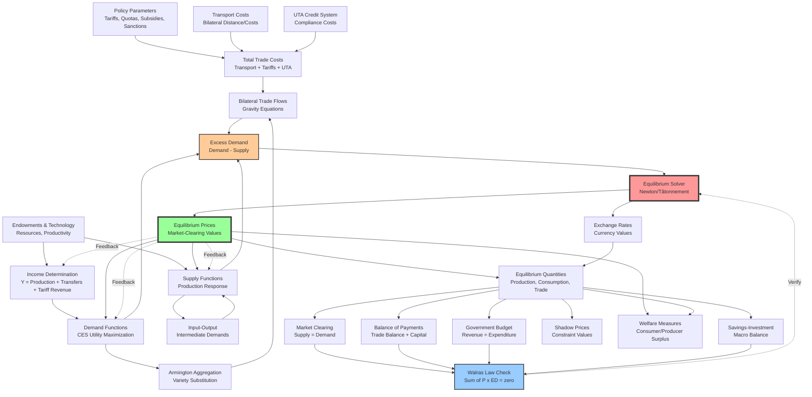

# Core Economic Modules and Their Interactions

## Essential Modules That Require Mathematical Formulation

### Demand-Side Modules

- **Consumer Demand Functions** - CES utility maximization determining how much each country wants of each product
- **Armington Preferences** - How countries view products from different sources as imperfect substitutes
- **Income Determination** - National income from production, tariff revenues, and transfers
- **Expenditure Allocation** - Two-stage budgeting across product categories and source countries

### Supply-Side Modules

- **Production Functions** - How countries transform inputs into outputs (CES or Cobb-Douglas)
- **Input-Output Linkages** - Intermediate goods requirements for production
- **Factor Markets** - Labor and capital allocation across sectors
- **Supply Response** - Price elasticity of production

### Trade Modules

- **Bilateral Trade Flows** - Gravity-like equations for trade between country pairs
- **Transport Costs** - Iceberg costs that "melt" value in transit
- **Trade Cost Matrix** - Full bilateral costs including transport and policies

### Policy Instruments

- **Tariff Wedges** - Price gaps created by import taxes
- **Quota Constraints** - Quantity limits creating shadow prices
- **Subsidy Effects** - Government support reducing effective costs
- **Sanctions/Prohibitions** - Forced zero trade flows

### Market Mechanisms

- **Excess Demand Functions** - The gap between demand and supply
- **Market Clearing Conditions** - Equilibrium requirements for each market
- **Zero Profit Conditions** - Competition driving profits to normal levels
- **Price Indices** - Composite prices across varieties

### Macro Constraints

- **Balance of Payments** - Foreign exchange market equilibrium
- **Government Budget** - Revenue equals expenditure plus deficit
- **Savings-Investment Balance** - Macro closure rules
- **Walras' Law** - Sum of all excess demands equals zero

### Solution Mechanisms

- **Equilibrium Solver** - Core algorithm finding market-clearing prices
- **Numeraire Normalization** - Pinning down absolute price levels
- **Exchange Rate Determination** - Currency value adjustments
- **Shadow Price Calculation** - Implicit values of binding constraints

### Enforcement System

- **UTA Credit Costs** - Additional transaction costs for compliance
- **Detection Probabilities** - Enforcement uncertainty effects
- **Compliance Penalties** - Costs of violations

### Welfare Measurement

- **Consumer Surplus** - Utility-based welfare gains/losses
- **Producer Surplus** - Profit-based welfare
- **Terms of Trade Effects** - Gains/losses from relative price changes
- **Total Welfare** - Aggregate country welfare

## System Flow Diagram




## Key Conceptual Relationships

### The Circular Flow

The system is fundamentally circular - prices determine quantities, but quantities (through market clearing) determine prices. This is why we need an iterative solver at the heart of the system.

### The Armington Structure

Products are differentiated by country of origin. American steel, Chinese steel, and German steel are treated as different (but substitutable) varieties. This creates a rich pattern of bilateral trade flows rather than simple one-way trades.

### The Role of Excess Demand

Excess demand is the core signal that drives the entire system. When demand exceeds supply, prices rise. When supply exceeds demand, prices fall. The equilibrium solver's job is to find prices where excess demand is zero everywhere simultaneously.

### Policy as Market Distortion

Tariffs, quotas, and subsidies create wedges between different prices:

- Tariffs: Gap between export price and import price
- Quotas: Shadow prices (quota rents) when constraints bind
- Subsidies: Gap between market price and producer receipts
- Sanctions: Infinite trade costs forcing zero trade

### Simultaneous Determination

Everything is determined simultaneously:

- All prices across all countries and products
- All quantities produced, consumed, and traded
- All exchange rates
- All shadow prices on constraints

This simultaneous system is what makes the problem computationally challenging - you can't solve one market in isolation.

### Welfare as Output

Once prices and quantities are determined, welfare effects can be calculated:

- Consumer welfare from price changes
- Producer welfare from profit changes
- Government revenue from tariffs
- Net welfare combining all effects

These welfare measures are what policymakers ultimately care about when evaluating trade policies.

# Newton vs Tâtonnement: Two Ways to Find Equilibrium

## The Core Problem Both Solve

Imagine you need to find the "right" prices for 5,000 different products across 50 countries simultaneously, where:

- If any price is too high, there's excess supply (unsold inventory)
- If any price is too low, there's excess demand (shortages)
- Changing one price affects all other markets through substitution and income effects

You need ALL markets to clear at once. It's like tuning 5,000 interconnected guitar strings where adjusting one affects all the others.

## Tâtonnement: The Auctioneer Method

### How It Works

Named after the French word for "groping" or "feeling around," this is the intuitive, gradual approach. Picture a giant auction house where an auctioneer is calling out prices for everything:

**Step-by-step Process:**

1. Start with initial guess prices
2. Calculate excess demand in every market
3. Raise prices where there's shortage (positive excess demand)
4. Lower prices where there's surplus (negative excess demand)
5. Repeat until all markets clear

### The Adjustment Rule

**New Price = Old Price + (Adjustment Speed × Excess Demand)**

If oil has 10% excess demand, raise oil price by some fraction of that 10%. If wheat has 5% excess supply, lower wheat price proportionally.

### Characteristics

**Strengths:**
- **Economically intuitive** - mimics how real markets work
- **Very robust** - almost always finds an answer eventually
- **Handles constraints well** - naturally respects bounds like non-negative prices
- **No complex calculations** - just needs to evaluate supply and demand

**Weaknesses:**
- **Painfully slow** - can take hundreds or thousands of iterations
- **Linear convergence** - each iteration makes roughly the same progress
- **Can oscillate** - prices might bounce back and forth around equilibrium
- **No guarantee of convergence** - without special conditions (like gross substitutes)

### When Tâtonnement Struggles

Imagine two products that are strong complements (like CPUs and motherboards):
- Raise CPU price → Lower CPU demand → Lower motherboard demand
- This suggests lowering motherboard price
- Lower motherboard price → Increase motherboard demand → Increase CPU demand  
- This suggests raising CPU price
- The cycle continues, potentially forever

## Newton-Raphson: The Smart Calculator Method

### How It Works

Instead of blind trial and error, Newton's method calculates exactly how each price affects each market, then jumps directly toward the solution.

**The Analogy:**
- Tâtonnement is like finding the bottom of a valley by always walking downhill
- Newton is like looking at the shape of the valley, calculating where the bottom must be, and jumping straight there

**Step-by-step Process:**
1. Start with initial guess prices
2. Calculate excess demand in every market
3. Calculate the "Jacobian" - how sensitive each excess demand is to each price
4. Solve a system of equations to find the price change that would zero out all excess demands
5. Jump toward that solution (maybe not all the way if it's too far)
6. Repeat until converged

### The Power of the Jacobian

The Jacobian is like a massive sensitivity matrix that tells you:
- If I raise US oil price by $1, how does that affect:
  - Demand for US oil? (large negative effect)
  - Demand for Saudi oil? (positive - substitution)
  - Demand for US cars? (negative - input cost)
  - Demand for Chinese electronics? (tiny effect)
  - ... and so on for all 5,000 markets

With this information, you can calculate exactly what price changes would eliminate all excess demands simultaneously.

### Characteristics

**Strengths:**
- **Blazingly fast near solution** - convergence accelerates as you approach equilibrium
- **Quadratic convergence** - each iteration is twice as accurate as the last
- **Typically 5-20 iterations** vs hundreds for tâtonnement
- **Precise** - can achieve machine-precision accuracy

**Weaknesses:**
- **Needs good starting point** - fails if you start too far from solution
- **Computationally intensive** - must calculate and invert huge matrices
- **Can diverge spectacularly** - might shoot off to infinity if poorly initialized
- **Sensitive to numerical issues** - small errors can compound

### When Newton Fails

Starting too far from equilibrium is like trying to find the bottom of a valley by looking only at the local slope when you're actually on a different mountain. Your calculation says "the bottom is that way" but you end up further from the true solution.

## The Hybrid Approach

The paper recommends combining both methods:

### Phase 1: Tâtonnement for Rough Positioning
- Use tâtonnement for 10-20 iterations
- Gets you "in the neighborhood" of equilibrium
- Slow but reliable progress

### Phase 2: Newton for Precise Solution
- Switch to Newton once you're close
- Rapidly converges to exact equilibrium
- 5-10 iterations to high precision

### Fallback Logic

**Try Newton**
```
If Newton diverges:
    Switch to tâtonnement with small steps
    After stabilization, retry Newton
If Newton still fails:
    Complete solution with tâtonnement alone
```
