# Trade Flow Module for UTA Simulation :Background information

## SECTION 1: THE BUSINESS QUESTION

**The Core Challenge**: When players adjust trade policies—imposing tariffs, banning imports, sanctioning countries—how do global trade flows actually reroute themselves? And critically, how do we detect when countries cheat the system by laundering goods through third parties?

**Player Decisions This Module Enables:**

1. **Trade Policy Dashboard**: Player sets 25% tariff on Chinese steel → system instantly shows:
   - How much trade diverts to Vietnam, India, South Korea
   - Which domestic producers gain market share
   - What percentage gets laundered back through third countries anyway
   - Net revenue impact to treasury
   - Consumer price increases

2. **Sanctions Evasion Detection**: Player sanctions Country X → system monitors:
   - Unusual trade spikes in neighboring countries
   - Products mysteriously appearing from countries that don't produce them
   - Alert triggers: "Warning: Country Y's aluminum exports to you increased 400% after you sanctioned Country X—possible triangulation"

**Real-World Intuition**: Think about water flowing through a network of pipes. When you block one pipe (tariff/sanction), water finds new paths—some legitimate (diverting to another supplier), some sneaky (flowing through a hidden pipe that relabels the water's source). Our job is to model both the physics of flow AND the detective work of catching cheaters.

---

## SECTION 2: THE PLAIN ENGLISH MECHANISM

### How Trade Actually Flows (The Story)

**Step 1: Countries Start with Production & Demand**
- Country A produces 100 tons of steel, needs 60 tons domestically → 40 tons available for export
- Country B produces 20 tons, needs 80 tons → needs to import 60 tons
- Country C produces 200 tons, needs 50 tons → 150 tons available for export

**Step 2: The "Gravity" Logic Kicks In**
Think of international trade like a dating app for countries:
- **Distance matters**: Country B prefers nearby suppliers (lower transport costs)
- **Size matters**: Big economies attract more trade (like popular profiles get more matches)
- **Preferences matter**: Historical relationships, language, trade agreements create "affinity"
- **Price matters**: Even if you prefer Country A's steel, if Country C offers 30% cheaper, you'll switch

**Step 3: Transport Costs Enter the Equation**
Every route has a "total delivered cost":
- **Base price**: What the exporter charges
- **Shipping cost**: Distance × mode (ship is cheap/slow, air is expensive/fast)
- **Chokepoint premiums**: Routes through Suez Canal, Panama, Malacca Strait cost extra
- **Tariffs & duties**: What the importing country charges
- **Insurance**: Risk premiums for unstable routes

**Example**: 
- Chinese steel: $500/ton + $50 shipping + $0 chokepoint + $125 tariff (25%) = $675 delivered
- Vietnamese steel: $520/ton + $30 shipping + $0 chokepoint + $0 tariff (FTA) = $550 delivered
- → Country B switches to Vietnam

**Step 4: Route Optimization With Constraints**
The system isn't just picking cheapest routes—it's solving a constrained puzzle:
- **Capacity limits**: Vietnam only produces 50 tons of steel—can't supply everyone who wants it
- **Multiple products**: Country B needs steel AND aluminum AND wheat—optimizes the whole basket
- **Quality differences**: Some buyers will pay premium for German engineering even if Chinese is cheaper
- **Geopolitical constraints**: Can't buy from sanctioned countries (officially)

**Step 5: Triangulation Detection (The Detective Work)**

This is where it gets interesting. When Player A sanctions Country X:

**Legitimate Response**:
- Country B (who used to buy from X) switches to Country Y
- Country Y's exports increase proportionally to Country X's lost sales
- Product mix makes sense (Y actually produces these things)

**Suspicious Pattern**:
- Country B still gets same products, but now "from" Country Z
- Country Z is a tiny economy that suddenly became a major exporter
- Country Z is geographically positioned between Country X and Country B
- Country Z imports raw materials from X, then exports finished goods to B
- **Red Flag**: Country Z's imports from X + exports to B = suspiciously matched volumes

**The Module's Job**: Build a system that routes trade flows realistically AND flags suspicious patterns automatically.

---

## SECTION 3: THE TECHNICAL SPECIFICATION

### Core Data Structures

#### 1. Bilateral Trade Tensor
**What it is**: A 3-dimensional spreadsheet
- **Dimension 1**: Exporting country (i)
- **Dimension 2**: Importing country (j)  
- **Dimension 3**: Product category (p)
- **Cell value**: T[i,j,p] = volume of trade from i to j for product p

**Business Translation**: Think of this as a massive pivot table where every cell answers "How much Product P does Country I sell to Country J?"

#### 2. Price Matrix
**What it is**: Delivered price for each route-product combination
- P[i,j,p] = base price + transport + tariffs + insurance
- Updates every simulation turn based on policy changes

#### 3. Route Registry (Graph Structure)
**What it is**: Network map of all possible trade routes
- **Nodes**: Countries and major transit hubs
- **Edges**: Trade routes with associated costs, capacities, transit times
- **Attributes**: Each edge stores (distance, mode, chokepoints crossed, current capacity utilization)

**Business Translation**: Like a shipping company's route planning system—knows all possible paths and their costs.

#### 4. Transit Trade Tracker
**What it is**: Special monitoring system for goods passing through intermediaries
- Tracks declared origin vs. actual origin
- Monitors volume mismatches (imports ≠ domestic consumption + exports)
- Flags statistical anomalies

---

## SECTION 4: THE ALGORITHM FLOWS (Detailed Mermaid Flowcharts)

### Master Flow: Trade System Per Turn

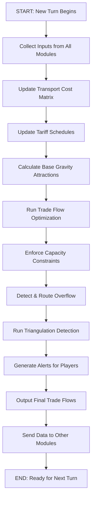

### Flow 1: Gravity Model Base Calculation

**Purpose**: Calculate "natural" trade affinity between every country pair for every product

```mermaid
graph TD
    A[For Each Product P] --> B[For Each Country Pair i,j]
    B --> C[Calculate Economic Mass Score]
    C --> C1["Mass = √(GDP_i × GDP_j)"]
    C1 --> D[Calculate Distance Factor]
    D --> D1["Distance = Geographic Distance + Cultural Distance"]
    D1 --> E[Calculate Affinity Modifiers]
    E --> E1["Modifiers: Common Language, Trade Agreements, Historical Trade"]
    E1 --> F[Calculate Base Attraction]
    F --> F1["Attraction = Mass / Distance × Modifiers"]
    F1 --> G{More Country Pairs?}
    G -->|Yes| B
    G -->|No| H{More Products?}
    H -->|Yes| A
    H -->|No| I[Return: Gravity Matrix G[i,j,p]]
```

**Key Insight**: This creates a "baseline preference" before we apply prices and constraints. It answers: "In a frictionless world, how much would Country I naturally trade with Country J?"

### Flow 2: Transport Cost Calculation

**Purpose**: Determine total delivered cost for each potential route

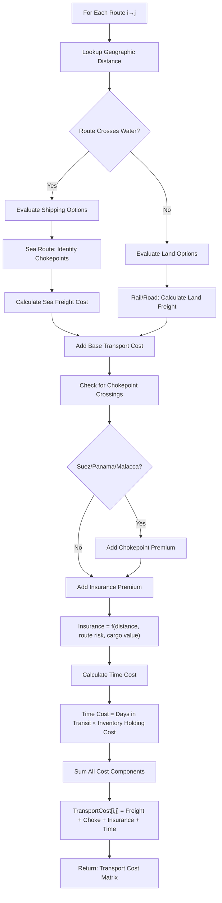

**Business Translation**: This is like getting a shipping quote—starts with distance, then adds premiums for difficult routes, insurance for risky areas, and opportunity cost for slow delivery.

### Flow 3: Trade Flow Optimizer (The Core Engine)

**Purpose**: Determine actual trade volumes given all constraints and prices

```mermaid
graph TD
    A[START: For Product P] --> B[Load Country Supply Capacities]
    B --> C[Load Country Demand Requirements]
    C --> D[Load All Route Costs]
    D --> E[Calculate Delivered Prices]
    E --> E1["DeliveredPrice[i,j] = BasePrice[i] + TransportCost[i,j] + Tariff[j,i]"]
    E1 --> F[Initialize Trade Flow Variables]
    F --> F1["TradeFlow[i,j] = 0 for all i,j"]
    F1 --> G[Run Optimization Loop]
    
    G --> G1[Sort All Possible Routes by Delivered Price]
    G1 --> G2[Start with Cheapest Route]
    G2 --> H{Importer j Still Needs Product?}
    H -->|No| G9
    H -->|Yes| I{Exporter i Has Capacity?}
    I -->|No| G9
    I -->|Yes| J[Calculate Max Tradeable Volume]
    J --> J1["MaxVol = min(Remaining_Supply[i], Remaining_Demand[j], Route_Capacity[i,j])"]
    J1 --> K[Allocate Trade Flow]
    K --> K1["TradeFlow[i,j] += MaxVol"]
    K1 --> L[Update Remaining Capacities]
    L --> L1["Remaining_Supply[i] -= MaxVol<br/>Remaining_Demand[j] -= MaxVol"]
    L1 --> G9[Move to Next Route]
    G9 --> G10{More Routes to Consider?}
    G10 -->|Yes| G2
    G10 -->|No| M{All Importers Satisfied?}
    M -->|Yes| N[SUCCESS: Market Clears]
    M -->|No| O[Handle Excess Demand]
    O --> O1["Flag Shortages<br/>Trigger Price Increases"]
    O1 --> N
    N --> P[Return: Final Trade Matrix T[i,j,p]]
```

**Key Business Logic**: 
- System acts like a smart procurement manager
- Always tries cheapest option first
- Moves to more expensive suppliers only when cheap ones run out
- Automatically reroutes around capacity bottlenecks

### Flow 4: Armington Substitution Handler

**Purpose**: Allow buyers to switch between suppliers based on relative prices, but with realistic "stickiness"

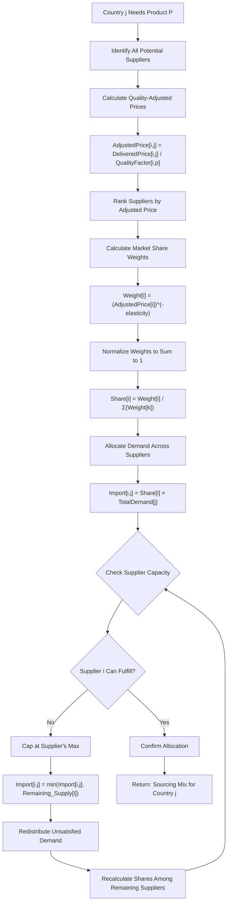

**Business Translation**: This is like how consumers choose between Apple, Samsung, Google phones—they have preferences (quality differences), but if Apple gets too expensive, some switch to Samsung. The "elasticity" parameter controls how sticky people are to their preferred brand.

### Flow 5: Triangulation Detection System

**Purpose**: Catch countries laundering trade through intermediaries to evade sanctions/tariffs

```mermaid
graph TD
    A[START: Monitor Trade Patterns] --> B[For Each Country Z Potential Transit Hub]
    B --> C[Calculate Import-Export Balance by Product]
    C --> C1["Balance[p] = Imports[Z,p] - Domestic_Consumption[Z,p] - Exports[Z,p]"]
    C1 --> D{Balance Close to Zero?}
    D -->|Yes, Normal| B2
    D -->|No, Suspicious| E[Flag for Investigation]
    E --> F[Analyze Source-Destination Patterns]
    F --> F1["Check: Do Z's Import Partners Match Export Destinations?"]
    F1 --> G{Suspicious Pattern Detected?}
    G -->|No| B2
    G -->|Yes| H[Calculate Anomaly Score]
    
    H --> H1[Factor 1: Volume Spike Analysis]
    H1 --> H2["Spike = Current_Volume / Historical_Average"]
    H2 --> I[Factor 2: Production Capacity Check]
    I --> I1{Does Z Actually Produce This?}
    I1 -->|Yes| I2["CapacityScore = 0"]
    I1 -->|No| I3["CapacityScore = 100"]
    I2 --> J
    I3 --> J[Factor 3: Geographic Logic]
    J --> J1{Is Z Between Sanctioned Country X and Importer Y?}
    J1 -->|Yes| J2["GeoScore = 50"]
    J1 -->|No| J3["GeoScore = 0"]
    J2 --> K
    J3 --> K[Factor 4: Timing Correlation]
    K --> K1["Check: Did Z's Exports Spike Right After Y Sanctioned X?"]
    K1 --> K2["TimingScore = Correlation Coefficient × 100"]
    K2 --> L[Calculate Total Anomaly Score]
    L --> L1["AnomalyScore = Spike + CapacityScore + GeoScore + TimingScore"]
    L1 --> M{Score > Threshold?}
    M -->|Yes| N[Generate Alert for Player]
    M -->|No| B2
    
    N --> N1["Alert: 'Possible triangulation detected'<br/>Country Z, Product P<br/>Likely Origin: Country X<br/>Final Destination: Country Y<br/>Confidence: [Score]%"]
    N1 --> B2[Next Country Z]
    B2 --> B3{More Countries to Check?}
    B3 -->|Yes| B
    B3 -->|No| O[Return: Alert List]
```

**Business Translation**: This is like a fraud detection system at a credit card company—looks for unusual patterns that don't match normal behavior. No single red flag proves guilt, but multiple red flags trigger an investigation.

### Flow 6: Capacity Constraint Enforcement

**Purpose**: Ensure trade flows respect real-world limits (port capacity, production capacity, transport capacity)

```mermaid
graph TD
    A[After Initial Trade Flows Calculated] --> B[Check Production Capacity Constraints]
    B --> B1[For Each Exporting Country i]
    B1 --> B2["Total_Exports[i] = Σ TradeFlow[i,j] across all j"]
    B2 --> B3{Total_Exports > Available_Supply?}
    B3 -->|No| C
    B3 -->|Yes| B4[Scale Down All Exports Proportionally]
    B4 --> B5["TradeFlow[i,j] = TradeFlow[i,j] × (Available_Supply / Total_Exports)"]
    B5 --> C[Check Transport Route Capacity]
    
    C --> C1[For Each Route i→j]
    C1 --> C2{TradeFlow > Route_Capacity?}
    C2 -->|No| D
    C2 -->|Yes| C3[Cap Flow at Capacity]
    C3 --> C4["TradeFlow[i,j] = Route_Capacity[i,j]"]
    C4 --> C5[Store Overflow Volume]
    C5 --> C6["Overflow[i,j] = Original_Flow - Route_Capacity"]
    C6 --> D[Check Port Capacity Constraints]
    
    D --> D1[For Each Country j]
    D1 --> D2["Total_Imports[j] = Σ TradeFlow[i,j] across all i"]
    D2 --> D3{Total_Imports > Port_Capacity?}
    D3 -->|No| E
    D3 -->|Yes| D4[Prioritize by Essentiality]
    D4 --> D5["Rank Products: Food, Energy, Medicine → Industrial → Luxury"]
    D5 --> D6[Allocate Capacity to Highest Priority First]
    D6 --> D7[Reject Lower Priority Flows]
    D7 --> E[Handle Rejected/Overflow Trade]
    
    E --> E1{Overflow Exists?}
    E1 -->|No| F[DONE: Constraints Satisfied]
    E1 -->|Yes| E2[Attempt Rerouting]
    E2 --> E3[Find Alternative Routes for Overflow]
    E3 --> E4["Try Next-Cheapest Routes with Available Capacity"]
    E4 --> E5{Reroute Successful?}
    E5 -->|Yes| E6[Update Trade Flows]
    E5 -->|No| E7[Mark as Unmet Demand]
    E6 --> F
    E7 --> E8["Signal Price Increase to Equilibrium Module"]
    E8 --> F
```

**Business Translation**: Like an airport managing flights—each runway, gate, and route has capacity limits. When demand exceeds capacity, you prioritize critical flights and delay or cancel low-priority ones.

---

## SECTION 5: KEY COMPONENTS IN PLAIN ENGLISH

### The Gravity Model Foundation

**What It Is**: A mathematical way to predict "natural" trade flows based on economic size and distance.

**The Logic**: 
- **Big economies trade more** (like big cities have more commuters)
- **Close countries trade more** (like neighbors borrow cups of sugar more often)
- **Similar countries trade more** (shared language, culture, legal systems reduce friction)

**How We Use It**: Creates a baseline expectation. If actual trade deviates significantly from gravity predictions, something interesting is happening (policy barriers, special relationships, or triangulation).

**No Math, Just the Concept**: 
Imagine every country has a "magnetic field" proportional to its economic size. The pull between two countries weakens with distance. Countries naturally "flow" toward strong, nearby magnets unless barriers block them.

### The Armington Assumption

**What It Is**: The idea that products from different countries aren't perfectly interchangeable—buyers have preferences.

**Real-World Examples**:
- German cars vs. Japanese cars: both are cars, but not identical substitutes
- French wine vs. Chilean wine: consumers perceive quality differences
- Chinese steel vs. American steel: industrial buyers may prefer domestic for reliability/support

**How We Use It**: When tariffs change prices, buyers don't instantly switch 100% to the cheapest source. They gradually shift based on how price-sensitive they are and how much they prefer their current supplier.

**Business Translation**: Brand loyalty with a price limit. People prefer iPhone, but if Android becomes 50% cheaper, some will switch. The "elasticity of substitution" measures how easily buyers switch.

### Transport Cost Function

**What It Is**: A system to calculate the total cost of moving goods from point A to point B.

**Components**:

1. **Base Freight Cost**
   - Sea shipping: cheap but slow (think: bulk cargo)
   - Air freight: expensive but fast (think: flowers, electronics)
   - Rail: middle ground (think: continental trade)
   - Road: flexible but costly for long distances

2. **Distance Effect**
   - Longer routes cost more (fuel, crew, time)
   - But not linearly—container ships are efficient at scale

3. **Chokepoint Premiums**
   - **Suez Canal**: Saves 3,500 miles vs. around Africa, but charges tolls + congestion
   - **Panama Canal**: Critical for Asia-East Coast US trade
   - **Malacca Strait**: 25% of world's traded goods pass through
   - These are strategic leverage points—if blocked or hostile, costs spike

4. **Insurance & Risk**
   - Piracy zones (Somalia coast) → higher premiums
   - War zones (Red Sea when unstable) → avoid or pay huge premiums
   - Political risk → some routes won't get insured at any price

5. **Time Value**
   - Goods sitting on ships aren't earning money
   - Perishables lose value over time
   - Fast fashion needs speed over cost savings

**Player Impact**: When players choose which countries to trade with, the transport cost module shows them the real economics—sometimes the cheapest producer isn't the cheapest delivered option.

---

## SECTION 6: ALGORITHM FLOW LOGIC (How It All Fits Together)

### The Overall Sequence (Turn-by-Turn)

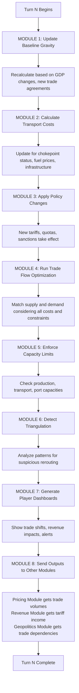

### Decision Tree: How the System Routes a Single Product Shipment

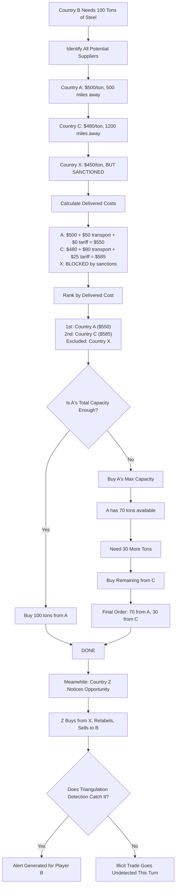

---

## SECTION 7: COMPUTATIONAL CONSIDERATIONS

### Processing Efficiency Challenges

**The Scale Problem**:
- 50 countries × 50 countries × 200 product categories = 500,000 possible trade relationships
- Each relationship needs cost calculation, capacity check, and optimization
- System must recalculate every turn (potentially every simulated month)

**Optimization Strategies**:

1. **Sparse Matrix Approach**
   - Most country pairs don't trade most products (e.g., Afghanistan doesn't export semiconductors to Brazil)
   - Only calculate for country-pairs with realistic trade potential
   - **Benefit**: Reduces computations by ~80%

2. **Hierarchical Product Grouping**
   - Aggregate 200 detailed products into 20 product families for gravity calculations
   - Only decompose to detailed level when player zooms in
   - **Benefit**: Speeds up bulk calculations

3. **Caching & Incremental Updates**
   - Transport costs change slowly—recalculate only when:
     - Infrastructure changes
     - Chokepoint disruptions
     - Fuel price shocks
   - Otherwise, reuse previous turn's matrix
   - **Benefit**: Saves 60% of transport cost calculations

4. **Parallel Processing**
   - Trade flow optimization for different products can run simultaneously
   - Each product's optimization is independent
   - **Benefit**: Near-linear speedup with multiple CPU cores

5. **Triangulation Detection Sampling**
   - Don't check every country every turn
   - Prioritize high-risk countries (geographically positioned between sanctioning country and sanctioned country)
   - Random sampling of low-risk countries
   - **Benefit**: Reduces detection workload by 70% with minimal accuracy loss

### Data Structure Recommendations

**For Trade Matrix**:
- Use sparse tensor format (only store non-zero values)
- Library suggestion: SciPy sparse matrices or PyTorch sparse tensors

**For Route Network**:
- Use graph database or graph library
- Library suggestions: NetworkX (Python), igraph, Neo4j

**For Anomaly Detection**:
- Time-series database for historical pattern tracking
- Library suggestions: InfluxDB, TimescaleDB, or Pandas with rolling windows

---

## SECTION 8: KEY PARAMETERS TO CALIBRATE

**What "Calibration" Means**: Setting the dials on our model so it produces realistic results that match real-world trade patterns.

### Critical Parameters List

| Parameter | What It Controls | Calibration Source | Example Value |
|-----------|------------------|-------------------|---------------|
| **Gravity Distance Decay** | How fast trade drops off with distance | IMF bilateral trade data | β = -1.1 (10% distance increase → 11% trade decrease) |
| **Gravity Economic Mass** | How much GDP predicts trade volume | World Bank GDP + UNCOMTRADE | α = 0.8 (10% GDP increase → 8% trade increase) |
| **Armington Elasticity** | How easily buyers switch suppliers when prices change | Academic literature by product | σ = 3 for commodities, σ = 8 for differentiated goods |
| **Transport Cost Coefficients** | $ per ton-mile by shipping mode | Shipping company data, Clarksons Research | Sea: $0.02/ton-mile, Air: $2.50/ton-mile |
| **Chokepoint Premiums** | % cost increase for using Suez, Panama, etc. | Canal authority data, shipping indices | Suez: +8%, Panama: +12%, Malacca: +3% |
| **Triangulation Detection Threshold** | What anomaly score triggers an alert | Historical smuggling cases | Score > 150 = High confidence alert |
| **Port Capacity Utilization** | How much throughput before congestion | World Shipping Council data | 80% utilization → delays begin |
| **Product Quality Factors** | How much buyers prefer certain origins | Consumer surveys, price premium analysis | German cars: 1.3× baseline, Chinese cars: 0.9× baseline |

### Calibration Process Flow

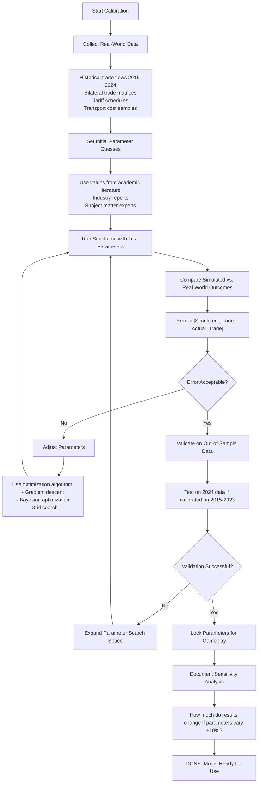

**Business Translation**: Calibration is like tuning a musical instrument—you adjust each string (parameter) until the model "sounds right" (matches reality). Then you check that it still sounds right when playing different songs (out-of-sample validation).

---

## SECTION 9: INTEGRATION POINTS (Data Handoffs)

### Inputs This Module Needs (From Other Modules)

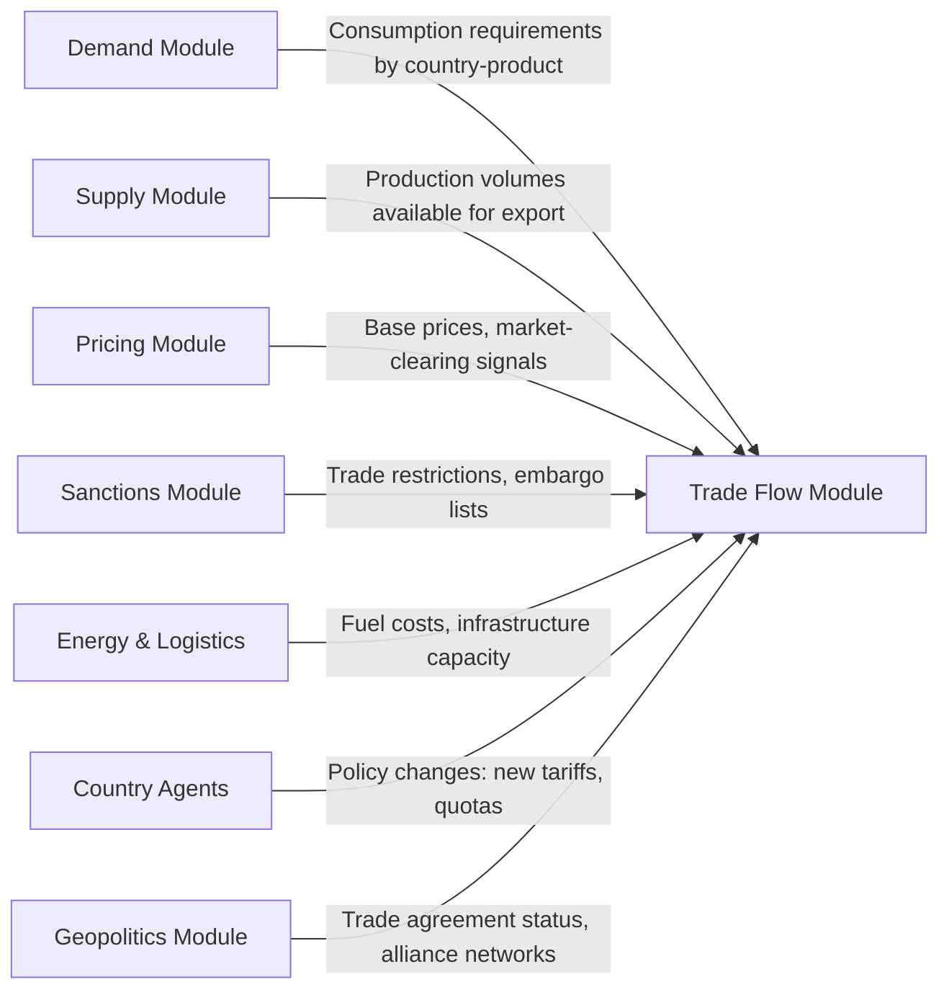

**Detailed Input Specifications**:

**From Demand Module:**
- **What**: Total consumption requirement by country, by product
- **Format**: Array D[country, product] = volume needed
- **Frequency**: Every turn
- **Example**: USA needs 100M tons of steel, 50M tons of aluminum, 200M tons of wheat

**From Supply Module:**
- **What**: Total production capacity, domestic consumption, exportable surplus
- **Format**: Array S[country, product] = volume available for export
- **Frequency**: Every turn
- **Example**: China produces 1B tons of steel, consumes 800M domestically, has 200M available to export

**From Pricing Module:**
- **What**: Current market prices, excess demand/supply signals
- **Format**: Array P[product] = base price; Signal[product, country] = "shortage" or "surplus"
- **Frequency**: Every turn
- **Example**: Steel base price = $600/ton; USA showing shortage signal → prioritize imports

**From Sanctions & Geopolitics Module:**
- **What**: List of banned trade relationships, tariff schedules, active trade agreements
- **Format**: Adjacency matrix Allowed[i,j] = TRUE/FALSE; Tariff[i,j,product] = rate
- **Frequency**: When policies change
- **Example**: USA sanctions Iran → Allowed[USA, Iran] = FALSE for all products

**From Energy & Logistics Module:**
- **What**: Current fuel prices, infrastructure status (ports open/closed, canals blocked)
- **Format**: FuelPrice = $/ton; Infrastructure[location] = status
- **Frequency**: Every turn
- **Example**: Suez Canal blocked → all routes through Suez unavailable this turn

### Outputs This Module Provides (To Other Modules)

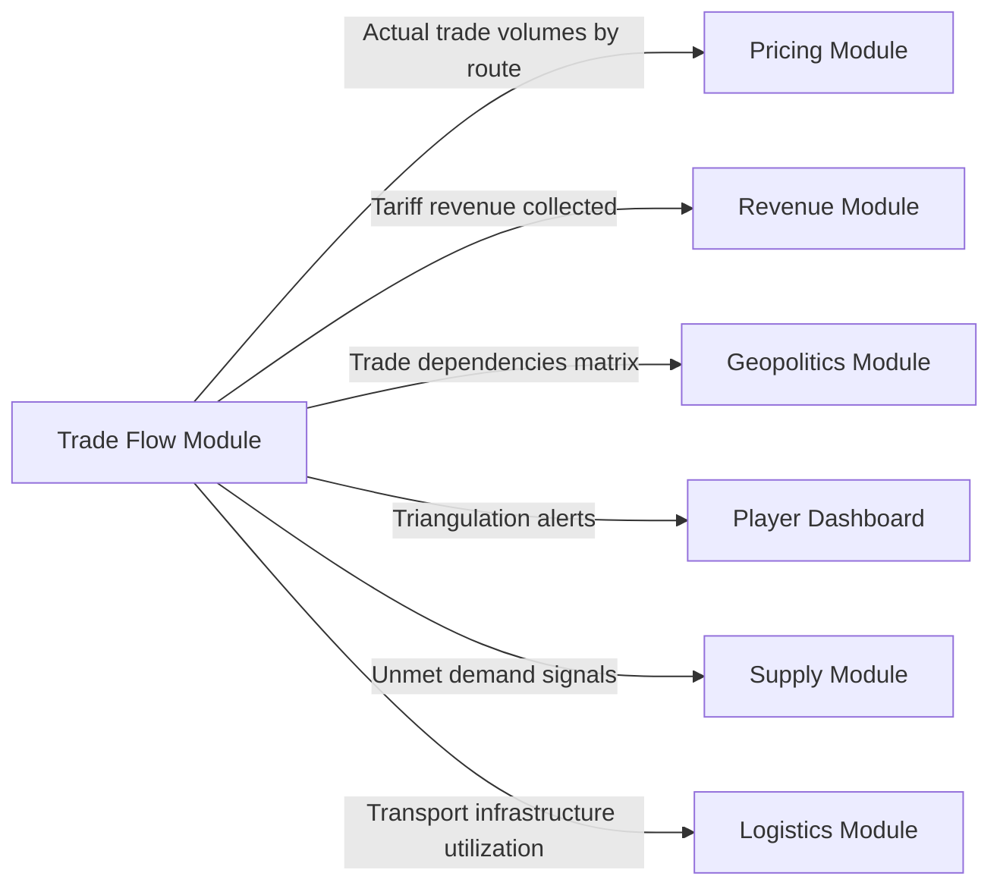

**Detailed Output Specifications**:

**To Pricing Module:**
- **What**: Final trade volumes that cleared the market
- **Format**: Matrix T[exporter, importer, product] = volume traded
- **Why Needed**: Pricing module uses this to verify market clearing and adjust prices
- **Example**: China exported 50M tons of steel to USA → helps determine next turn's steel price

**To Revenue Module:**
- **What**: Tariff revenue collected by each country
- **Format**: Array TariffRevenue[country] = $ collected
- **Why Needed**: Feeds into government budget calculations
- **Example**: USA collected $5B in tariff revenue from steel imports

**To Geopolitics Module:**
- **What**: Trade dependency scores (how much Country A relies on Country B)
- **Format**: Matrix Dependency[A,B] = $ value of critical imports from B to A
- **Why Needed**: Determines leverage in diplomatic negotiations
- **Example**: Germany's 60% energy dependence on Russia → Russia has leverage

**To Player Dashboard:**
- **What**: Trade policy impact predictions and triangulation alerts
- **Format**: JSON objects with descriptions and confidence scores
- **Why Needed**: Players need to see consequences of their decisions
- **Example**: "Your 25% steel tariff will increase domestic prices by 12% and generate $8B revenue, but China may retaliate against your soybeans"

**To Supply Module:**
- **What**: Unmet demand signals (products that couldn't be sourced)
- **Format**: Array Shortage[country, product] = volume unmet
- **Why Needed**: Signals to producers to expand capacity
- **Example**: USA couldn't import 10M tons of needed steel → price signal to domestic steel producers to ramp up

---

## SECTION 10: VALIDATION METRICS (How We Know It's Working)

### Test Suite Categories

#### 1. Bilateral Trade Accuracy Test
**What We're Testing**: Does the model reproduce real-world trade patterns?

**Test Process**:
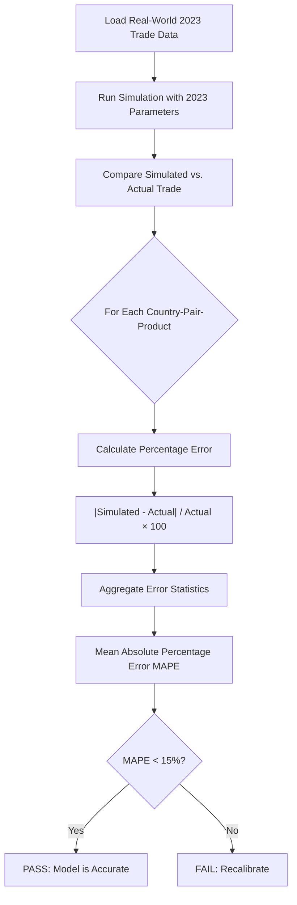

**Success Criteria**:
- Mean Absolute Percentage Error < 15% for major trade flows (>$1B annually)
- 90% of country-pairs within 25% of actual trade volumes
- Top 20 bilateral relationships (USA-China, Germany-France, etc.) within 10%

#### 2. Gravity Model Fit Test
**What We're Testing**: Do the gravity coefficients match economic literature?

**Test Process**:
- Run regression: log(Trade) = α + β₁×log(GDP_i) + β₂×log(GDP_j) + β₃×log(Distance) + ε
- Compare coefficients to published academic studies
- **Expected Ranges** (from meta-analysis of 100+ papers):
  - GDP elasticity: 0.7 to 1.0
  - Distance elasticity: -0.9 to -1.3

**Success Criteria**:
- Our coefficients fall within literature ranges
- R² > 0.7 (model explains 70%+ of trade variation)

#### 3. Price Pass-Through Test
**What We're Testing**: When tariffs change, do prices adjust correctly?

**Test Scenario**:
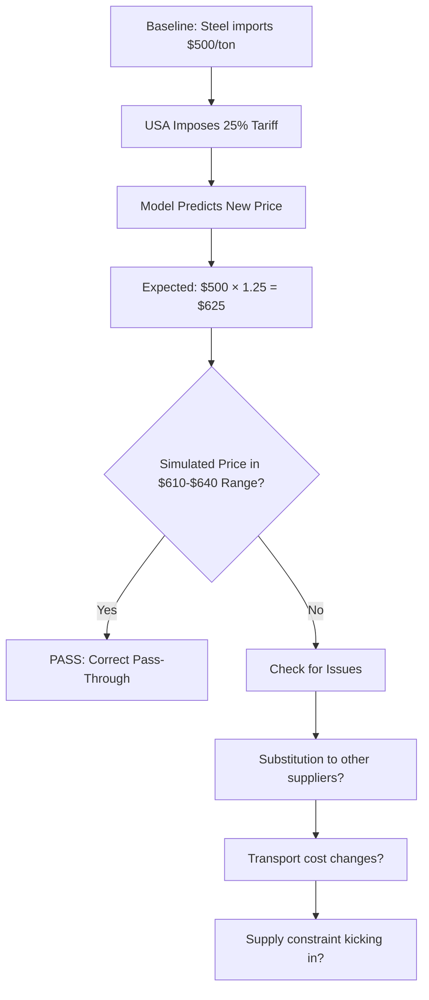

**Success Criteria**:
- Short-term: 80-100% of tariff passes through to consumer prices
- Long-term: 50-70% pass-through (as substitution occurs)

#### 4. Triangulation Detection Rate Test
**What We're Testing**: Can we catch known circumvention cases?

**Test With Historical Data**:
- **Case 1**: Chinese solar panels routed through Vietnam/Malaysia after US tariffs (2018-2020)
- **Case 2**: Russian oil routed through India/Turkey after sanctions (2022-2024)
- **Case 3**: Iranian oil through various intermediaries (2012-present)

**Test Process**:
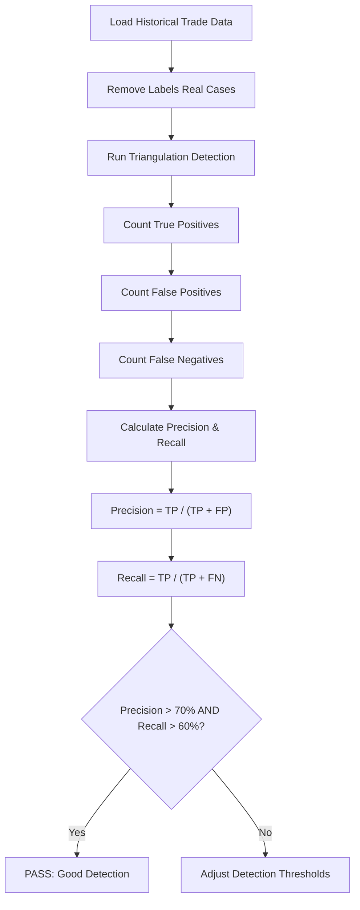

**Success Criteria**:
- Precision > 70% (when we alert, we're usually right)
- Recall > 60% (we catch most real cases)
- False positive rate < 20% (don't cry wolf too often)

#### 5. Trade Balance Consistency Test
**What We're Testing**: Does all trade add up correctly? (Accounting integrity)

**Test Logic**:
- **Global Rule**: Σ(all exports) must equal Σ(all imports)
- **Country Rule**: Country A's reported exports to B = Country B's reported imports from A

**Test Process**:
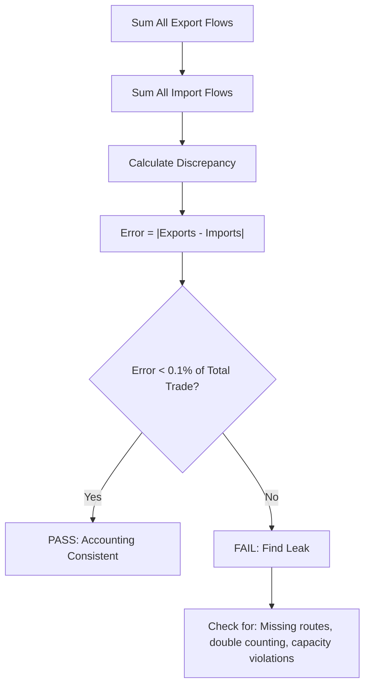

**Success Criteria**:
- Global trade imbalance < 0.1% (rounding errors only)
- All bilateral flows match exactly (no ghost trade)
---

